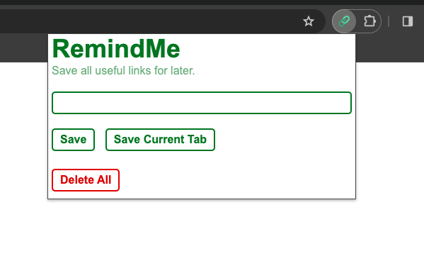
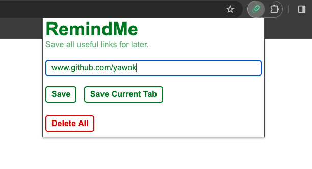
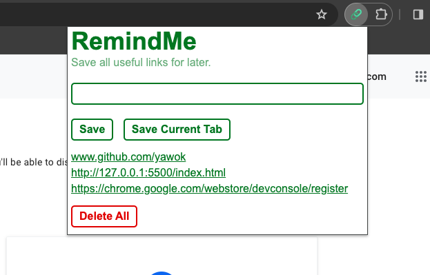

# RemindMe
A Chrome extension that reminds you to visit saved links.

# Functionalities
- [x] Save url of the current tab with just 1 click.
- [x] Save url entered into text field.
- [x] Persistence of saved urls.
- [x] Delete all saved urls with one click.
- [ ] Delete all saved urls individually.
- [ ] Validate urls
- [ ] Occational reminders of saved urls.

# Gallery

:skull: Currently not available on the Chrome extension store.